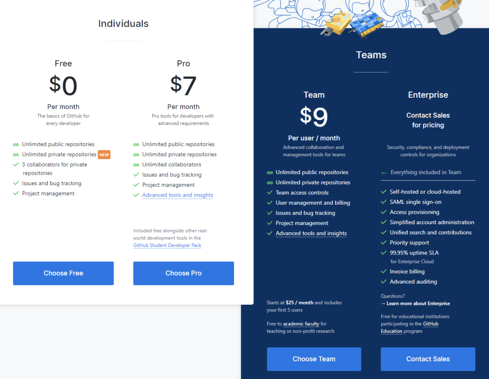
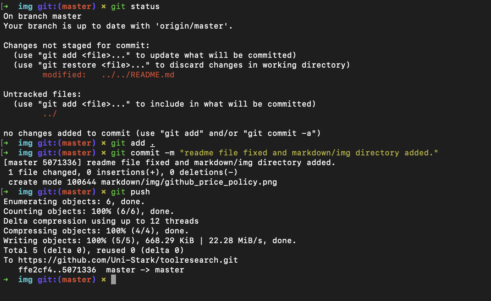
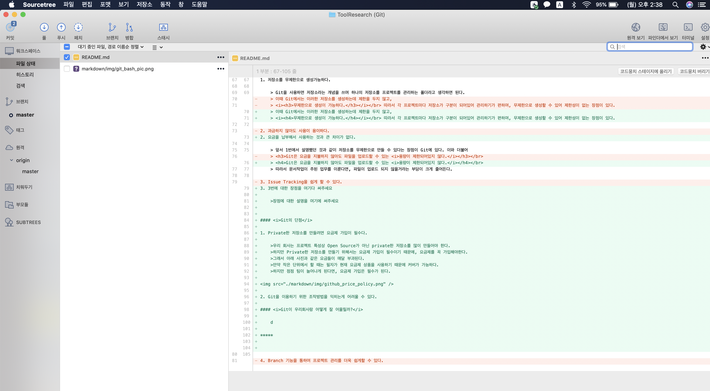

# Tool Research

### 작성자 : 김광운
### 작성일 : 2019.11.15일 시작

# 1. Intro - <i>"혼돈의 카오스를 피하자"</i>

	카톡으로 파일 보내고, 어떤 이 가장 최신이냐 서로서로 물어가던 시절이 있었다. 하지만 점차 할 일이 많아지고, 다양화 되면
    이러한 파일 공유나 관리는 혼돈의 카오스를 만들어 낸다. 이러한 혼돈의 카오스를 미연에 방지하고자 우리가 사용해야 할 협업 
    툴을 조사하여 만든 Git 저장소이다. 이 글을 보면서 어떤 것들이 좋을지에 대한 해답을 찾긴 어렵지만 실마리를 찾으면 하는
    바램으로 글을 작성한다.
    

 

# 2. Why? - <i>"왜를 알면 효율성이 극대화된다"</i>

	막상 협업 툴을 조사하면서 우리가 왜 이러한 협업 툴을 써야 하는지에 대한 필요성을 상기시킬 필요가 있다. 
    그냥 쓰는것보다 왜 써야하는지 정확한 원인 파악 후 사용하면, 더욱 효율적으로 쓸 수 있게된다.
    무작정 쓰라고 해서 협업툴을 사용한다면, 이걸 왜 사용해야 하는지에 대한 필요성이나, 장점들을 모른 채 넘어갈 수 있다.
    그래서 내가 생각하는 협업툴을 사용해야 하는 필요성에 대하여 생각해서 나열해 보았다.

1. 효율적인 프로젝트 관리
    >자주 있는 예를 들겠다. 이사님께서 나에게 파일을 받았냐고 물어보시고, 나는 다시
    이 파일에 대하여 임대리님한테 물어보고 임대리님은 또 송상무님에게 물어보는 
    상황이 발생할 수 있다. 물론 사무실 특성상 이는 조금 더 쉽게 이루어질 수 있는 대화일 수 있다.
    하지만 이러한 대화는 "이 파일 제가 어제 수정했어요!", "내가 어제 작성해서 누구한테 보냈는데!?"
    라는 코멘트가 붙으며, 최신 파일은 누구에게 있는지 파일을 서로 비교해보고 대조해보는 상황이 발생할 수 있다.
    이러한 상황은 프로젝트 관리 Tool을 사용하여 항상 최신을 유지해 파일을 비교 대조해보는 상황을 피할 수 있게 된다.

2. 다양한 피드백의 보존
    >서류작성, 자료조사, 코딩 등과 같은 프로젝트와 관련된 업무를 진행할 떄 우리는 파일을 공유하고,
    그 파일에 대한 피드백을 서면이 아닌 구두로 전한다. 이러한 피드백은 구두로만 전해지기 때문에
    피드백에 대한 내용의 변질, 혹은 잘못된 이해가 생길 수 있다. 이러한 상황을 보존된 피드백을
    통하여 방지할 수 있다.

3. 스케쥴 관리의 간편화
    >자잘한 개인의 스케쥴이 아닌, 회사 팀원끼리 공유해야할 스케쥴이 있다면,
    협업툴에 해당 날짜에 무슨 이슈가 있는지 등록하고 간단한 구두로 전하면 된다.
    스케쥴의 내용은 내용을 등록하며 디테일하게, 스케쥴에 대한 언급은 간단히 구두로 전하면
    회사 스케쥴관리를 간편화할 수 있게된다.

 

# 3. Which? - <i>"그럼 뭘 써야 할까요?"</i>

	이제 왜 써야 하는지 알았다면, 우리에게 가장 알맞는 툴이 무엇이 있는지 알아볼 시간이다. 소개할 툴은
    n가지로써 내가 생각해보고 이 툴은 괜찮을 것 같다고 한것들만 선별한 것이다. 이제 그 툴들에 대하여 설명해보겠다.

*****

## Git - <i>"개발자들이라면 누구나 다 아는 프로젝트 관리 툴" </i>

가장 먼저 소개할 것은 Git이다. Git은 컴퓨터 파일의 변경사항을 추적하고 여러 명의 사용자들 간에 해당 파일들의 작업을 조율하기 위한 분산 버전 관리 시스템이다
>많은 사람들이 지칭하는 Github는 Git을 쉽게 관리하기 위한 웹 호스팅 서비스이다.
>쉽게 말하자면 Git을 관리하기 위해 웹 사이트로 만들어 놓은 UI/UX이다.

#### <i>Git의 장점</i>

1. 저장소를 무제한으로 생성가능하다.

	> Git을 사용하면 저장소라는 개념을 쓰며 하나의 저장소를 프로젝트를 관리하는 폴더라고 생각하면 된다.
	> 이때 Git에서는 이러한 저장소를 생성하는데 제한을 두지 않고,
	> <i><h4>무제한으로 생성이 가능하다.</h4></i>  따라서 각 프로젝트마다 저장소가 구분이 되어있어 관리하기가 편하며, 무제한으로 생성할 수 있어 제한성이 없는 장점이 있다.

2. 요금을 납부해서 사용하는 것과 큰 차이가 없다.

	> 앞서 1번에서 설명했던 것과 같이 저장소를 무제한으로 만들 수 있다는 장점이 Git에 있다. 이와 더불어
	> <h4>Git은 요금을 지불하지 않아도 파일을 업로드할 수 있는 <i>용량이 제한되어있지 않다.</i></h4> 
	> 따라서 문서작업이 주된 업무를 이룬다면, 파일이 업로드 되지 않을거라는 부담이 크게 줄어든다.

3. 3번에 대한 장점을 여기다 써주세요

	>장점에 대한 설명을 여기에 써주세요

#### <i>Git의 단점</i>

1. Private한 저장소를 만들려면 요금제 가입이 필수다.

	>우리 회사는 프로젝트 특성상 Open Source가 아닌 private한 저장소를 많이 만들어야 한다.
	>하지만 Private한 저장소를 만들기 위해서는 요금제 가입이 필수이기 때문에, 요금제를 꼭 가입해야한다.
	>그래서 아래 사진과 같은 요금들이 매달 부과된다.
	>만약 작은 단위에서 할 때는 필자가 현재 요금제 상품을 사용하기 때문에 커버가 가능하다.
	>하지만 점점 팀이 늘어나게 된다면, 요금제 가입은 필수가 된다.  

 
2. Git을 이용하기 위한 조작방법을 익히는게 어려울 수 있다.

>Git을 주로 사용하는 직군은 개발자 직군이 많다. 개발자들에게 있어서 GUI보다 CLI가 익숙한 경우가 있다.
그래서 GUI(Graphic User Interface)보다 CLI(Command Line Interface)를 이용해서 Git을 관리하는 경우도 존재한다. 그래서 송상무님이나 신이사님이 이용하기에는 다소 무리가 있을 수 있다.	물론 아래 Sourcetree사진을 보면 UI/UX를 통하여 관리할 수 있지만, 새로운걸 배워야 한다는 진입장벽이 존재하기 때문에 팔자가 문서를 잘 만들면 극복할 수 있다고 생각된다. 

<h4>Git bash</h4> Git bash를 이용하기 위해서는 이와같이 명령어를 입력해 주어야한다.  

<h4>Sourcetree</h4> 명령어나 CLI를 잘 다루지 못한다면 위 사진과 같은 GUI로 Git 저장소를 관리할 수 있다.

#### <i>Git이 우리회사랑 어떻게 잘 어울릴까?</i>

	d

*****

